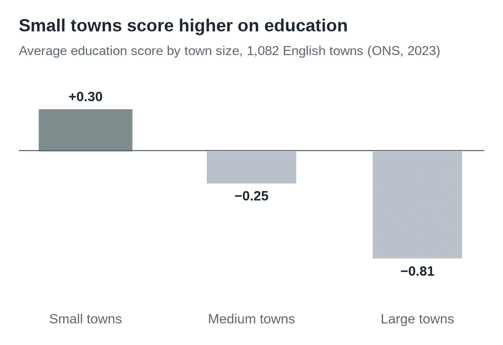
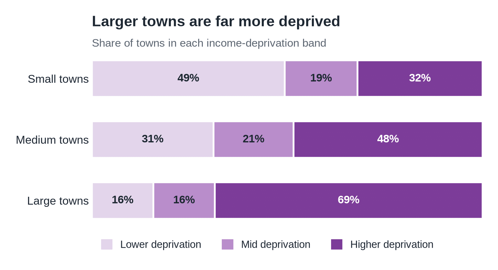
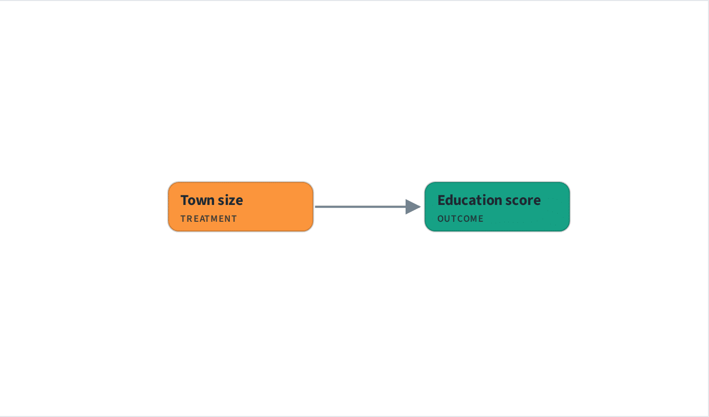
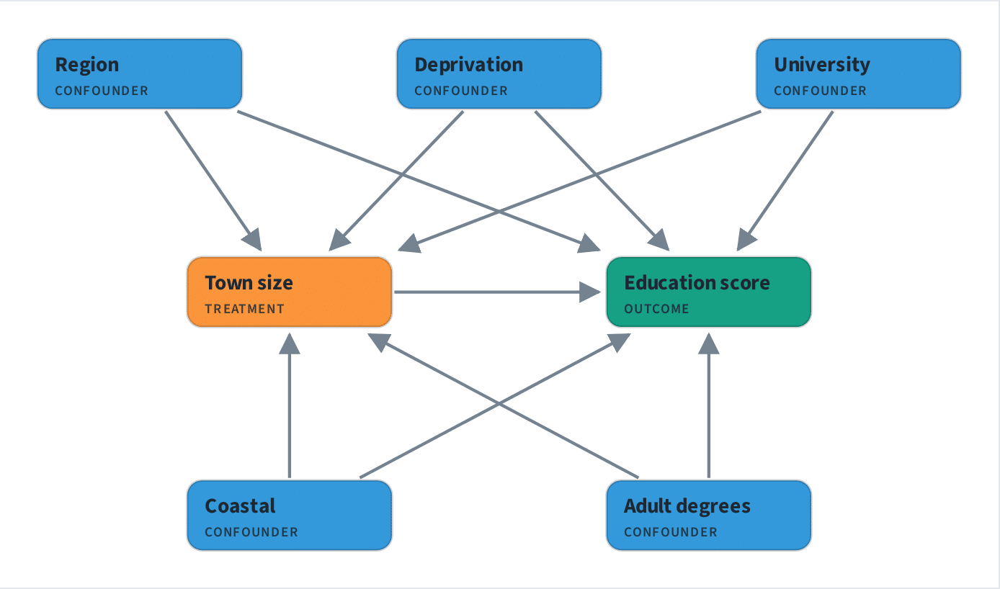
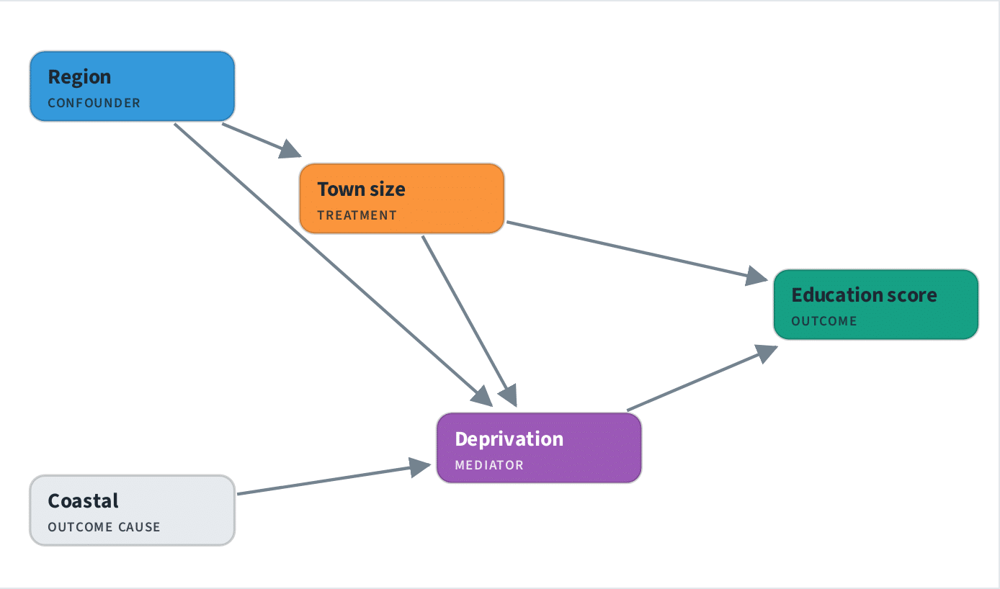

In 2023 the Office for National Statistics asked a question in a headline: *why do children and young people in smaller towns do better academically than those in larger towns?* The data is public, and across 1,082 English towns the gap is real: small towns average +0.30 on a standardised attainment score, large towns −0.81.



I spent a while with that dataset. Here are three ways to read it. The first two are standard practice. Only the third tells you what is going on.

| Large vs small towns | Effect on attainment |
| --- | --- |
| **1\. The correlation** (what the ONS reported) | −1.11 points |
| **2\. Control for everything** (what I was taught) | **+0.59** points |
| **3\. The causal story:** total effect | −1.28 points |
| ↳ the part flowing through deprivation | −1.99 points |
| ↳ the direct effect, deprivation held fixed | **+0.70** points |


The first says small towns are better. The second says large towns are better. Both are computed correctly, from the same data. Neither tells you why, and the one that looks more rigorous is the one that misleads you more quietly.

The third says something neither of them can: the small-town advantage is almost entirely about deprivation. Hold deprivation fixed and the *large* towns come out ahead.

* * *

## 1\. The correlation

The ONS is careful with its words. It says town size, income deprivation and adult qualifications are all "related to" attainment, and that smaller towns do better "partly because a larger share of these towns have low levels of income deprivation." That is a fair description of a correlation.

But the headline asks *why*, and a comparison of averages cannot answer a why question. It cannot separate what size does from what comes along with size.

What comes along with size, in post-industrial England, is deprivation. 32% of small towns fall in the higher-deprivation band, against 69% of large towns. And the deprivation gap in attainment: 5.18 points, 1.43 standard deviations — is about four times larger than the biggest town-size gap. The headline is mostly measuring wealth while pointing at geography.



"Partly because" undersells it. Deprivation is not a footnote to a town-size story. It is most of the story, and once it is accounted for, the size effect underneath points the other way.

Small towns win - on average they achieve better education attainment. Education attainment here is a composite index taking into account the same children's key stage exam results through the ages of 11 to their degree programs (if they went to university) As noted, there are multiple reasons that explain factors that are related to the high-performing towns - correlations between town characteristics and education attainment.



*The graph the correlation implicitly assumes: nothing else matters.*

* * *

## 2\. Control for everything

So the obvious move is to control for deprivation. That is what I was trained to do, and it is where the second mistake starts.

I have a Masters in Business Analytics. It was a good degree; I use it. It covered regression properly, then regularisation, cross-validation, tree ensembles, standard errors, the bootstrap. Estimation in real depth.

Somewhere in there I absorbed a rule that was never stated outright but was implied by every assignment: **when in doubt, control for more things.** Put the covariates in. Watch adjusted R² rise. More controls means fewer lurking variables, means a more defensible estimate. Rigour, operationalised as column count.

Do that here — region, deprivation, coastal, university, adult qualifications, all in — and the town-size coefficient flips to **+0.59**, with p = 0.048. Large towns are better. It looks like the careful answer, and it is the kind of number that gets written up as a finding.

That rule is not merely incomplete. It is wrong in two separate ways, and the second one is genuinely alarming.



*What 'control for everything' assumes: every variable is a background cause.*

### Wrong the first way: it changes the question without telling you[](https://github.com/george-lindley/causal-blocks/blob/main/essay/causality-belongs-in-the-curriculum.md#wrong-the-first-way-it-changes-the-question-without-telling-you)

Deprivation is not a confounder in the towns analysis, it is a **mediator**. Part of what it means to be a large town in post-industrial England *is* to carry more deprivation. Deprivation sits on the causal path from size to attainment, rather than sitting outside it muddying the comparison.

Control for a confounder and you remove bias. Control for a mediator and you close off part of the causal effect you were trying to measure. You get an answer to "what if every town were equally deprived?" That can be a good question, and below I argue it is an important one here. But it is not the question the regression output claims to answer, and it is not what your reader will assume you reported.

Adjusted R² goes *up* when you add the mediator. Every model-selection instinct I was trained on pushes toward the wrong specification.

I got this wrong myself, in a way that is worth admitting because it is the whole point. The tool I built for this project originally let me hand-pick a colour for each node in my causal diagram. I coloured deprivation as a confounder: that is what it intuitively feels like, a background condition getting in the way. But I had drawn the arrows as `town size → deprivation → attainment`. My picture and my graph said different things for weeks and nothing caught it, because the label was an assertion sitting next to the structure instead of a consequence of it.

The fix was not to be more careful. It was to delete the option: work out what each variable *is* from the graph itself, and never let anyone declare it. When two things have to agree, do not check them against each other: derive one from the other, and the disagreement becomes impossible to express.

### Wrong the second way: it can create bias out of nothing[](https://github.com/george-lindley/causal-blocks/blob/main/essay/causality-belongs-in-the-curriculum.md#wrong-the-second-way-it-can-create-bias-out-of-nothing)

The first failure is subtle. This one should change how you work.

Take a graph where two hidden causes exist: `U1` affects `X` and `M`; `U2` affects `M` and `Y`. And crucially, **there is no arrow from `X` to `Y` at all** — the true effect is exactly zero, by construction.

Simulate 40,000 rows and regress:

```
True effect of X on Y   :  0.000
Naive  (Y ~ X)          : -0.006   ← correct
Adjusted (Y ~ X + M)    : -0.201   ← invented from nothing
```

The naive regression gets it right. **Adding a control variable makes a correct answer wrong.**

`M` is a **collider** — two arrows point into it. Colliders block the paths they sit on, so `X` and `Y` start out unassociated, which is exactly what the naive regression reports. Conditioning on a collider *opens* that path. Once you hold `M` fixed, learning `U1` tells you about `U2`, and that manufactured association propagates into a spurious link between `X` and `Y`.

The everyday version: suppose talent and looks are independent in the population, but either one can get you into Hollywood. Among *actors*, the two will be negatively correlated — a talentless actor who made it probably got there on looks. The correlation is pure artefact of looking only at people who got in. Conditioning on the collider created it. Statisticians call this Berkson's paradox, or selection bias, and it is the reason "we only had data on people who signed up" is a sentence that should stop a meeting.

You cannot detect any of this in the output. The fit looks fine. R² improves. Every diagnostic is unremarkable. "Control for everything" throws in the colliders along with the confounders, and nothing warns you. The only way to know is to have written down what causes what, *before* fitting anything.

* * *

## 3\. Causation: the real story[](https://github.com/george-lindley/causal-blocks/blob/main/essay/causality-belongs-in-the-curriculum.md#3-causation-the-real-story)

Here is the same statistical operation — add a variable to a regression — with three different consequences:

| The variable is a… | Adjusting for it… |
| --- | --- |
| **Confounder** | removes bias. Required. |
| **Mediator** | changes which question you answered. |
| **Collider** | creates bias that was not there. Never do it. |

The data cannot tell you which case you are in. All three produce correlations that look identical in the matrix. What distinguishes them is the causal structure, and causal structure does not live in the data — it comes from domain knowledge, written down and defended before you fit anything.

The field has a word for this and I did not learn it: **identification.** Not "what estimate do I get" but "is the quantity I want recoverable at all from the data I have, under assumptions I am willing to state out loud?" It is a question about your assumptions, answerable before any data is loaded, and it can fail — telling you that no amount of modelling will get you what you want.

Judea Pearl's **backdoor criterion** gives the actual rule: adjust for a set of variables that blocks every non-causal path from treatment to outcome, without opening any new ones. Note that it is a statement about a *graph*. Not about a dataframe, a p-value, or a fit statistic.

For the towns, the graph I would defend is short. Region shapes both town size and deprivation, so it is a confounder. Town size affects deprivation, and deprivation affects attainment, so deprivation is a mediator. Draw that, and the graph tells you what to estimate and what each estimate means:

-   The **total effect** of being a large rather than a small town is **−1.28 points**. Adjust for region, and nothing else. This is the honest version of the ONS comparison.
-   That total splits in two. **−1.99 points flow through deprivation.** The **direct effect** — the answer to "what if every town were equally deprived?", is **+0.70 points**, in favour of large towns.



*Causation modelled correctly: 'the real story'*

These claims do not all rest on the same ground, and the graph shows that too. The total effect needs only the assumption that region is the confounder that matters. The direct effect needs more: that nothing unmeasured causes both deprivation and attainment. School funding history, local labour markets and decades of industrial decline are all plausible candidates, and none is in the data. So I hold the first part of the story firmly and the second part as a strong suggestion:

-   **Firm:** the small-town advantage is deprivation. Town size is standing in for wealth.
-   **Suggestive:** among equally deprived towns, larger ones do better.

That asymmetry is itself something the causal framework makes visible. A regression table would have printed both numbers with the same confidence.

* * *

## Why business analytics specifically[](https://github.com/george-lindley/causal-blocks/blob/main/essay/causality-belongs-in-the-curriculum.md#why-business-analytics-specifically)

Every field has gaps. This one is different because of what the degree is *for*.

Business analytics is not a descriptive discipline. Nobody commissions an analysis to learn that two things correlate. They commission it to decide something: whether to run the campaign, change the pricing, fund the programme, open in the smaller market. Every one of those is a question about what happens *if we intervene* — and questions about intervention have a different mathematical form from questions about association. That is the entire point of the do-operator.

We were trained on tools that answer the second kind of question, and pointed at jobs that consist almost entirely of the first kind. The gap gets filled with folk methodology: control for everything, cite the p-value, add a "correlation is not causation" disclaimer, and then write recommendations that are causal anyway because that is what was asked for.

The disclaimer is the tell. Everyone knows the distinction exists. Almost nobody is taught what to *do* about it.

And the fix is not expensive. Not a new degree, not a semester of measure theory. A few weeks: DAGs, the backdoor criterion, confounders and mediators and colliders, and the practice of drawing your assumptions before you fit. It slots in beside regression, because it is what tells you whether the regression answers your question. It could reasonably come *before* the machine learning module, an identification error cannot be fixed by a better estimator, and gradient boosting applied to the wrong estimand just gets you a very precise wrong number.

* * *

## What it costs to skip it[](https://github.com/george-lindley/causal-blocks/blob/main/essay/causality-belongs-in-the-curriculum.md#what-it-costs-to-skip-it)

Back to the towns.

"Children in smaller towns do better academically" is true, and it points somewhere: at scale, at community, at school size. Reasonable policy follows from it, about how we build and organise schools in large towns.

"Less deprived places do better academically, and small towns are less deprived" is also true, of the same data, and points somewhere else entirely: at money.

Identical dataset. Identical correlation. Opposite implications. The only thing separating them is a causal structure that has to be argued for, made explicit, and exposed so someone can disagree with it.

I would not have known to ask which one I had. That is what I mean when I say causality belongs in the curriculum — not as an advanced elective for people who have finished the real material, but as the thing that decides whether the real material answers the question you were hired to answer.

**You can try all three readings yourself at [causalblocks.com](https://causalblocks.com/):** draw the graph, and watch the estimate change as the arrows do.

* * *

*The full analysis, the simulated worked examples, and the small library that derives variable roles from graph structure are in [causal-blocks](https://github.com/george-lindley/causal-blocks). Data: ONS, [Educational attainment of young people in English towns](https://www.ons.gov.uk/peoplepopulationandcommunity/educationandchildcare/datasets/educationalattainmentofyoungpeopleinenglishtownsdata) (2023), Open Government Licence v3.0. The ONS article quoted is [Why do children and young people in smaller towns do better academically than those in larger towns?](https://www.ons.gov.uk/peoplepopulationandcommunity/educationandchildcare/articles/whydochildrenandyoungpeopleinsmallertownsdobetteracademicallythanthoseinlargertowns/2023-07-25) (25 July 2023).*

*Figures here compare large towns with small ones. The interactive demo reports the same models per size band (small → medium → large), so its numbers are roughly half these: a total effect of −0.70 per band against −1.28 here.*
