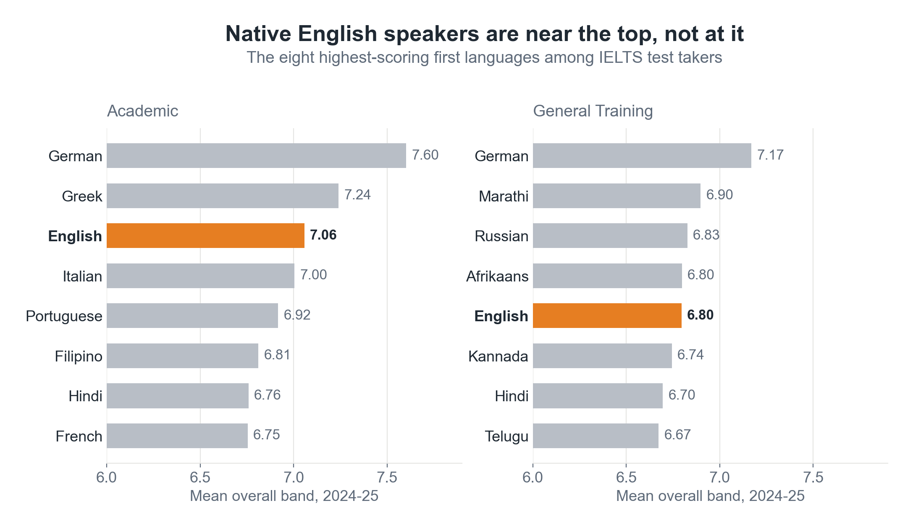

In August 2026, [#TidyTuesday](https://github.com/rfordatascience/tidytuesday/blob/main/data/2026/2026-08-18/readme.md) published three years of IELTS test statistics: mean scores in Listening, Reading, Writing and Speaking, broken down by first language and by nationality. The first thing I looked for was the obvious one. Surely the people whose first language is English score highest on an English test?

They don't. In 2024-25, German speakers led the Academic test with a mean band of 7.6. Native English speakers came third, and fifth in General Training. In three years of data, English has never ranked first.

It's a good headline. It's also not a finding about English speakers.

## 1\. The table measures who sits the test

The data only contains people who chose to sit IELTS. A German speaker usually takes it because they have decided to study abroad in English: a highly educated, self-selected group. A native English speaker usually takes it only because a visa or a registration body requires it, often in a country such as Nigeria, India or the Philippines, where English is one of several everyday languages.

A causal graph shows the problem:

"Sits IELTS" is a **collider**: both being a native speaker and being highly educated lead people to the test. Looking only at people who sat it creates a link that doesn't exist in the wider population. Among test takers, non-native speakers are disproportionately the ambitious and well-educated, while native speakers are often there because they were made to be.

So the league table can't tell us who speaks the best English. The people who never sat the test aren't in the data, and no statistics can bring them back. Is there a question this data *can* answer?

## 2\. A better question

One pattern kept catching my eye. Groups from multilingual African countries, where English is used every day, score far higher in **Speaking** than in **Writing**. A natural hypothesis: where English is an official language, people hear and speak it daily, so their spoken English runs ahead of their written English.

That question gets round the selection problem in a simple way. Instead of comparing one group's score with another's, it compares two skills within the same group: **Speaking minus Writing**. The people are the same in both tests, so whatever brought them to IELTS is the same too.

Splitting the score into its two skills shows how this works:

-   **Education**, and everything else that selects who sits the test (wealth, ambition, preparation), lifts speaking and writing together. Add the same amount to both, subtract one from the other, and it disappears. That's why the collider from the first graph stops mattering: the bias it creates runs through the *level* of a group's English, and the gap ignores the level.
-   **Spoken exposure** pushes only speaking up, so it survives the subtraction. That's the effect I want to see.
-   **School quality** pushes mostly writing up, so it survives too, and it still needs dealing with.

The subtraction removes the causes that lift both skills and keeps the ones that favour one over the other. Each group is its own baseline.

For whether English is official, I used Wikipedia's [list of countries where English is an official language](https://en.wikipedia.org/w/index.php?title=List_of_countries_and_territories_where_English_is_an_official_language&oldid=1378630797), pinned to one revision so anyone can rebuild the column.

Here is the causal story:

The effect I want runs along the top: **official English → more English spoken day to day → a bigger speak–write gap**. But there's a second route. Countries where English is official are mostly former British colonies, and colonial history also shaped their school systems, which affect writing. Colonial history is a **confounder**: it could produce a gap even if official status did nothing.

Colonial history isn't in the data, but **region** captures much of it. So I compared countries only with their neighbours, using the [World Bank's regions](https://datahelpdesk.worldbank.org/knowledgebase/articles/906519).

## 3\. Comparing neighbours

That comparison only works where a region has both kinds of country. Every country from Sub-Saharan Africa in the data has official English, so there's nothing to compare it with, and the striking African pattern can't be tested. Europe and Latin America have the opposite problem. That leaves **East Asia & Pacific** and **South Asia** (plus the Middle East, for the Academic test only): the Philippines, Malaysia, Pakistan and India alongside Vietnam, China, Japan and South Korea.

To check the difference isn't luck, I shuffled the "official" labels between countries in the same region 20,000 times and counted how often the shuffled difference was as big as the real one. That's a **permutation test**, and it needs no assumptions about the shape of the data.

## 4\. The result

Compared with their neighbours, nationalities where English is official speak further ahead of their writing: by **about a fifth of a band**, in both the Academic and General Training tests, in all three years. The General Training result is clear (p < 0.01 each year); the Academic one is borderline (p ≈ 0.03 to 0.05).

A fifth of a band is small, but it's consistent: six tests, all pointing the same way.

## 5\. What this doesn't show

-   **Region is only a stand-in for colonial history.** In Asia, official English comes with a whole package: the language of schooling, exams, media. The effect may belong to the package, not the legal status.
-   **These are still test takers, not populations.** The difference removes most of the selection problem, not all of it.
-   **It's small.** About seven Asian countries have official English, and each is a national average.

## 6\. Why the graph came first

The league table at the start was the easy analysis, and it was the wrong one. The numbers weren't wrong; the question just couldn't be answered with this data. Drawing the graph showed that before any model was fitted: one question was blocked by who sits the test, and another could be answered by comparing neighbours.

That's the case for drawing causal graphs first. They don't give you the answer. They tell you which questions your data can answer at all.

* * *

*Thanks to [Georgios Karamanis](https://karaman.is/blog/2026/08/tidytuesday-2026-34), whose TidyTuesday chart, "Germany speaks the best test English", coloured countries by whether English is official and set me looking at this question. The data is IELTS's published [test statistics](https://ielts.org/researchers/our-research/test-statistics) for 2022-23 to 2024-25, via [#TidyTuesday](https://github.com/rfordatascience/tidytuesday/blob/main/data/2026/2026-08-18/readme.md). The causal graphs are drawn in the style of [Causal Blocks](https://causalblocks.com).*
