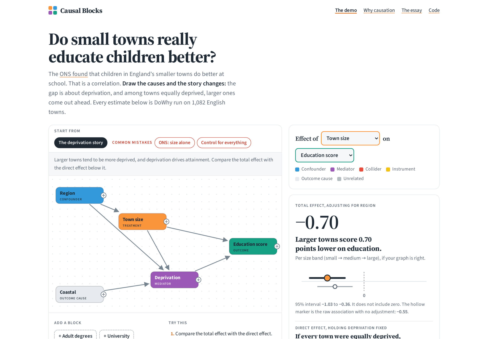

## Solution Overview

"Correlation is not causation" is one of the first things anyone learns about data. Almost nobody is taught what to do instead. Most statistics and analytics courses teach estimation in depth, then leave students with a rule of thumb: when in doubt, control for more variables. That rule can quietly change the question being answered, or create bias that wasn't there.

Causal Blocks is an interactive tool for learning causal inference by doing it. Students drag real data columns onto a canvas as blocks, draw arrows for what they believe causes what, and watch an estimate from DoWhy, Microsoft's causal inference library, update with every arrow. Each variable is coloured by the role the graph gives it: confounder, mediator, collider or instrument. The graph explains itself.

## The Demo: England's Small Towns

The first example uses ONS data on educational attainment across 1,082 English towns. The ONS reported that children in smaller towns do better at school. The demo shows three readings of the same data:

-   The correlation: small towns look better.
-   Controlling for everything: the sign flips, and large towns look better.
-   The causal graph: it explains why. The small-town advantage runs almost entirely through deprivation, and among equally deprived towns, larger ones come out ahead.

Two red "common mistake" presets let students reproduce each wrong reading and see what went wrong.

## Analytics Approach

-   Precomputed causal estimates. Every combination of treatment, outcome and adjustment set across seven variables (960 in total) was run through DoWhy in advance, each with three refutation tests. The site answers instantly and needs no server.
-   Identification in the browser. DoWhy's rules for choosing what to adjust for were ported to JavaScript, covering both the total and the direct effect. Automated tests check the port against DoWhy itself on 600 randomly generated graphs.
-   Plain-English coaching. Each result comes with a headline sentence ("Larger towns score 0.70 points lower on education") and an explanation of what the graph did: which variables were adjusted for, which were left out, and why.

## Who It's For

-   Students in statistics, analytics and data science, learning why the choice of controls matters.
-   Lecturers who want a live classroom example of confounding, mediation and collider bias.
-   Analysts who were taught to "control for everything" and want to see where that goes wrong.

## System Architecture

A static site hosted on GitHub Pages, with no backend. A Python build step runs DoWhy across every combination and writes the results to a small data file. In the browser, the graph logic picks the same adjustment set DoWhy would and looks the answer up. A companion Python library, causalblocks, derives variable roles from graph structure for use in notebooks, and has its own test suite.

## Future Development

The next step is "bring your own data": upload a CSV, turn its columns into blocks, and run DoWhy directly in the browser, with no data leaving the student's machine. A proof of concept already runs the full DoWhy pipeline in the browser with results identical to native Python. Further worked examples from other fields will follow, since the towns data is only the first case study.

## Links

-   Live site: [causalblocks](https://causalblocks.com)[.](https://causalblocks.com)[com](https://causalblocks.com)
-   Essay: [Do small towns really educate children better?](/do-small-towns-really-provide-better-education-a-uk-detective-story/)
-   Source code: [github.com/george-lindley/causal-blocks](http://github.com/george-lindley/causal-blocks) (open source, MIT)
