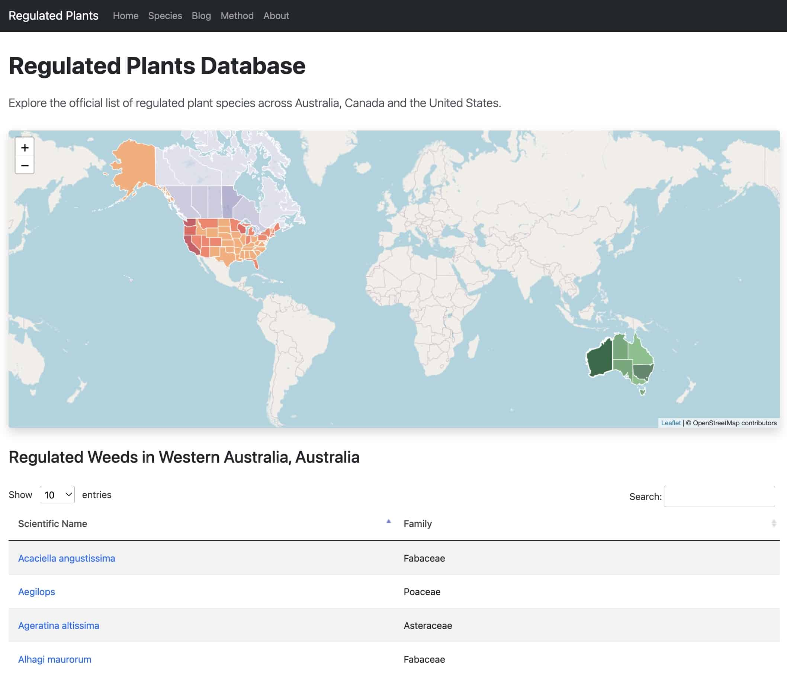
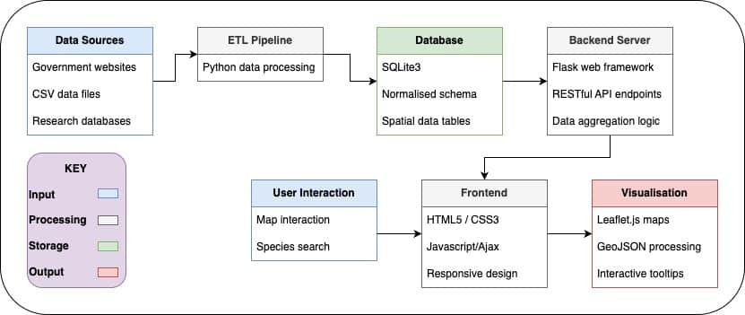

Across the world, governments publish lists of regulated plant species to protect ecosystems, agriculture, and biodiversity. However, these lists are scattered across agencies, jurisdictions, and formats, making it difficult to answer even basic analytical questions:

-   Which regions face the highest regulatory burden?
-   Where do policies diverge or align?
-   Which species create the greatest cross-border compliance risk?

This data cleaning and data analytics project was built to answer those questions clearly.

## Solution Overview

We developed a comprehensive analytical database of 1,000+ regulated plant species, paired with an interface designed for decision-making, not data browsing. The system supports two primary analytical entry points:

1.  **Geospatial Analysis**: Visualizing regulatory density across states/provinces through interactive mapping
2.  **Species-Based Analysis**: Searching by specific plant species to identify all jurisdictions where it faces regulation

Below is a screenshot of our homepage. To see the full website please go to [www.regulatedplants.unu.edu](http://www.regulatedplants.unu.edu)

*Screenshot of the homepage - search regulated plants by location (geospatial analysis)*

## Data Analytics Approach

This project was designed as an analytics system from the ground up, with the interface serving the analysis for all users visiting the website.

### 1\. Data Structuring & Normalisation

Regulatory lists from multiple jurisdictions were consolidated into a unified analytical dataset, standardising:

-   Species taxonomy
-   Jurisdiction hierarchy (state, country, and international)
-   Regulatory classification (such as 'low/high', and 'A/B/C')

This step resolved inconsistencies that typically prevent meaningful comparison across regions.

### 2\. Metric & Threshold Design

To support decision-making, raw counts were transformed into interpretable signals:

-   Jurisdiction-level regulations - allowing the user to toggle between state/country/international
-   Fixed analytical thresholds enabling cross-region comparison
-   Visual encoding optimised for policy interpretation

The emphasis was on clarity and comparability.

### 3\. Analytical Interfaces

Two complementary analytical views were implemented to cater for different user groups (see 'stakeholder groups' below):

-   Geospatial analysis to reveal regulatory patterns at a glance
-   Species-centric analysis to assess cross-jurisdictional risk

## Stakeholder Impact

This analytical platform delivers measurable value to multiple stakeholder groups:

-   **Agricultural Professionals**: Identify high-risk regulatory zones to inform cultivation planning and compliance strategy
-   **Farmers and Landowners**: Quickly verify regulatory status of existing or planned plantings in specific locations
-   **Research Scientists**: Target specific regions for comparative studies based on regulatory patterns
-   **Policy Makers**: Benchmark regulatory approaches against neighboring jurisdictions to inform policy development
-   **Conservation Organizations**: Identify regions with heightened focus on invasive species control

By transforming fragmented regulatory data into actionable intelligence, this platform significantly reduces compliance research time while improving decision-making quality across multiple domains.

## System Architecture

The system architecture reflects a common analytics pattern, taking input from various *data sources*, alongside the *user interaction* to create instant and useful visualisation as can be seen in below diagram.

## Future Development: Prescriptive Analytics

A natural next step is decision APIs. We've separated the website and data storage deployments, to build a professional-grade API on top of the data. As well as powering the Regulated Plants web app, the API will also be open to paying e-commerce websites for real-time prescriptive analytics.

We are approaching e-commerce giants to integrate the API into their websites, to ensure that their customers are warned if they are purchasing plants and shipping them to a jurisdiction where they are prohibited due to their invasive quality.

## Recognition and Deployment

-   Officially hosted by United Nations University (UNU-INWEH)
-   Featured within the UNU Sustainability Nexus AID Tools collection
-   Presented at Dresden Nexus Conference 2025
-   Developed in collaboration with UC Davis Plant Sciences, with full affiliation

**Live platform:**

[https://regulatedplants.unu.edu](https://regulatedplants.unu.edu)  
**Code repository (open source):**

[https://github.com/oozr/invasive\_plants](https://github.com/oozr/invasive_plants)

**View our latest press release:**

[https://unu.edu/inweh/news/regulated-plants-database-unus-new-open-access-tool-help-prevent-spread-harmful-plants](https://unu.edu/inweh/news/regulated-plants-database-unus-new-open-access-tool-help-prevent-spread-harmful-plants)
