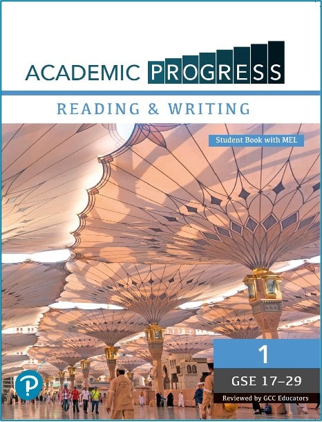
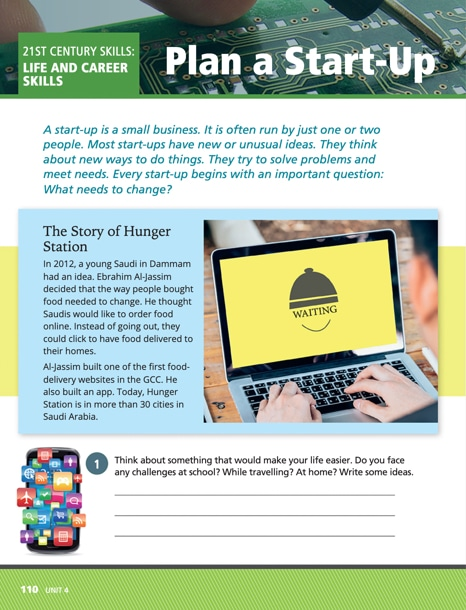

Designing and Scaling a Curriculum-Aligned English Programme for the Middle East

In 2019, as Learning Consultant for Pearson Middle East, I led the regional coordination and market validation process for the development of a new English language course series: **Academic Progress**.

The objective was not simply to launch a new textbook, but to design a product that:

-   Reflected actual classroom realities
-   Aligned with institutional procurement expectations
-   Addressed regulatory and cultural requirements
-   Scaled sustainably across universities in the region

The series became Pearson’s number one-selling English course across Africa, the Middle East, and Turkey in 2020, 2021, and 2022.

The success was rooted in a structured, data-led development framework.

* * *

# Strategic Framework: A Five-Stage Development Model

Rather than beginning with content assumptions, we began with structured market intelligence.

* * *

## Step 1: Market Data Collection

I led the sales team in systematically collecting institutional data on:

-   Course structures currently in use
-   Competitor materials
-   Skill segmentation models
-   Curriculum configurations across preparatory year programmes

The goal was strategic positioning.

Instead of building a product from scratch, we selected a global base title from Pearson’s portfolio that most closely aligned with existing market structures. This reduced switching friction and increased adoption feasibility.

The approach mirrored early-stage market analytics: start with observable demand patterns before building supply.

* * *

## Step 2: Data Analysis & Market Segmentation

Analysis revealed:

-   55% of preparatory year revenue (addressable market) used split-skills courseware  
    (separate Reading/Writing and Listening/Speaking components)
-   Existing materials were largely “academic-lite,” favouring general-interest themes over STEM-oriented content

This insight shaped product positioning:

-   Maintain structural compatibility (split-skills model)
-   Elevate academic depth and skills integration
-   Differentiate through stronger institutional alignment

This was less about creative publishing and more about strategic product-market fit.

* * *

## Step 3: Structured Focus Group Design

We then conducted targeted focus groups with selected institutional representatives.

Participants were chosen based on:

-   Current product usage
-   Classroom experience with target learners
-   Institutional influence
-   Potential as early adopters

The objective was dual:

1.  Identify product gaps relative to competitor offerings
2.  Build institutional champions through co-creation

This stage transformed customers from end-users into contributors within the design cycle.

* * *

## Step 4: Localised Product Development

The regional product team developed the series with structured input from selected institutional contributors.

Key refinements included:

-   Cultural and contextual alignment with regional sensitivities
-   Inclusion of regionally relevant case studies and topics
-   Introduction of two new lower-level bands to widen accessibility
-   Dedicated 21st-century skills sections within each unit

These changes were not cosmetic. They reduced institutional resistance and strengthened curriculum alignment.

* * *

## Step 5: Iterative Review & Early Adoption Strategy

A second structured review phase was conducted with selected academic reviewers.

Reviewers were:

-   Carefully selected for strategic institutional relevance
-   Compensated and formally credited
-   Positioned as early adopters within their institutions

Two reviewers became first adopters of the series.

One year later, their structured feedback informed the final refinement pass — creating the edition still in circulation today.

* * *

# Execution as Institutional System Design

From a strategic perspective, Academic Progress demonstrates:

-   Data-led product positioning
-   Institutional market segmentation
-   Structured stakeholder integration
-   Regulatory and cultural localisation
-   Early adopter activation strategy
-   Scalable regional rollout

Rather than viewing education publishing as content creation, this project treated it as a systems problem:

Market intelligence → Product alignment → Institutional co-creation → Early adoption → Iterative refinement → Regional scaling.

* * *

# Commercial & Strategic Impact

Academic Progress became Pearson’s best-selling English course across Africa, the Middle East, and Turkey for three consecutive years.

While commercial figures remain confidential, the measurable impact included:

-   Wide institutional adoption
-   Sustained renewal cycles
-   Multi-year market penetration
-   Strong alignment with preparatory year programme structures

The success was not driven by aggressive sales tactics, but by disciplined market alignment and structured product design.

* * *

# Why This Project Matters

This project sits at the intersection of:

-   Education systems strategy
-   Institutional market analytics
-   Regulatory navigation
-   Scalable product execution

It complements my work in AI analytics (Menacon) and regulatory systems mapping (Regulated Plants) by demonstrating the same underlying principle:

**Complex, policy-driven environments require structured system design — not surface-level optimisation.**
