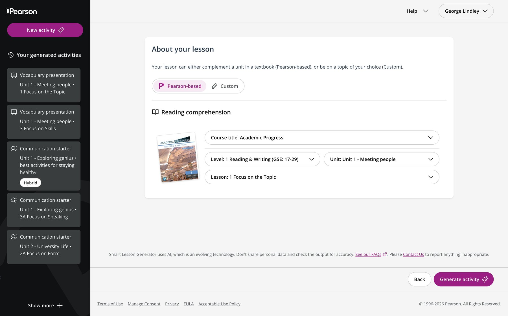

Designing and Scaling a Digital-First English Programme for the Middle East

In 2019, as Learning Consultant for Pearson Middle East, I led the regional market research and business case for a new English language programme: **Academic Progress**.

Universities in the Middle East were on a fast-track course towards digitization, and they wanted courseware that matched: interactive, measurable, and relevant to their students. The objective was to design a programme that:

-   Worked as a digital product first: an interactive eBook, online practice and progress data
-   Reflected real classroom needs and local culture
-   Aligned with institutional procurement and regulatory requirements
-   Scaled across universities and countries in the region

The series became Pearson's number one-selling English course across Africa, the Middle East and Turkey between 2020 and 2025. I worked across teams for its launch in Saudi Arabia, and then expansion to Qatar, Kuwait and the UAE.

The success was rooted in a structured, data-led development framework.

* * *

# Development Model

We began with structured market intelligence and included customer feedback in every step.

* * *

## Step 1: Market Data Collection

I led the sales team in systematically collecting institutional data on:

-   Course structures currently in use
-   Skill segmentation models
-   Curriculum configurations across preparatory year programmes

We selected a global base title from Pearson's portfolio that most closely matched existing market structures, and rebuilt it for the region with an identified USP. This kept the budget down and reduced switching friction.

The approach mirrored early-stage product analytics: start with observable demand patterns before building supply.

* * *

## Step 2: Data Analysis & Market Segmentation

Analysis revealed:

-   55% of preparatory year revenue (the addressable market) used split-skills courseware (separate Reading & Writing and Listening & Speaking components)
-   Existing materials were largely "academic-lite", favouring general-interest themes over STEM-oriented content
-   A digital presentation tool was key for teachers, who are among the decision makers

This insight shaped product positioning:

-   Keep structural compatibility (the split-skills model)
-   Raise academic depth and skills integration from an earlier level
-   Add KSA context to a greater degree than the competitors (content that is culturally sensitive and culturally relevant)
-   Differentiate through digital delivery first

This was less about publishing and more about product-market fit.

* * *

## Step 3: Structured Focus Group Design

We then ran targeted focus groups with selected institutional representatives, chosen for:

-   Current product usage
-   Classroom experience with target learners
-   Institutional influence
-   Potential as early adopters

The objective was dual:

1.  Identify motivational topics for the students and identify preferred teaching/learning styles
2.  Build institutional champions through co-creation

This stage turned customers from end users into contributors within the design cycle.

* * *

## Step 4: Localised, Interactive Content

The regional product team developed the series with structured input from selected institutional contributors. Key refinements included:

-   Cultural and contextual alignment with the region
-   Regionally relevant case studies and topics that students recognise
-   Two new lower-level bands to widen access
-   Dedicated 21st-century skills sections in each unit

Every unit lives in an interactive eBook, with embedded activities and links straight into online practice. The "Plan a Start-Up" lesson, for example, is built around Hunger Station, the food-delivery app founded in Dammam: a story Saudi students know, used to teach problem-solving and entrepreneurship.

These changes alligned with the digitisation strategy of the Saudi universities, and created more motivational lessons for the students.

* * *

## Step 5: Iterative Review & Early Adoption Strategy

A second structured review phase was conducted with selected academic reviewers, who were:

-   Selected for strategic institutional relevance
-   Compensated and formally credited
-   Positioned as early adopters within their institutions

Two reviewers became first adopters of the series. A year later, their structured feedback informed the final refinement pass, creating the edition still in use today.

* * *

# Empowering Teachers with AI

Digital tools for teachers were part of the business case from the start, and the programme keeps adding them. The latest is the Smart Lesson Generator: teachers choose a level, unit and lesson of Academic Progress, and AI builds a ready-to-use activity, such as a vocabulary presentation or a communication starter, aligned to that lesson. It gives teachers back preparation time and makes the series easier to adopt across a whole department.

* * *

# Execution & System Design

From a strategic perspective, Academic Progress demonstrates:

-   Data-led product positioning
-   Institutional market segmentation
-   Digital-first delivery, from interactive eBook to AI tools for teachers
-   Regulatory and cultural localisation
-   Early adopter activation
-   Scalable regional rollout

Taken together, these steps are system design rather than publishing: each stage fed the next, and the whole programme was built around the universities' own goals for digital learning.

Market intelligence → Product alignment → Institutional co-creation → Early adoption → Iterative refinement → Regional scaling.

* * *

# Commercial & Strategic Impact

Academic Progress became Pearson's best-selling English course across Africa, the Middle East and Turkey for three consecutive years.

While commercial figures remain confidential, the measurable impact included:

-   Wide institutional adoption
-   Sustained renewal cycles
-   Multi-year market penetration
-   Strong alignment with preparatory year programme structures

The success was driven by disciplined market alignment and a product built for how Gulf institutions teach today, alongside successful sales and marketing strategy.

* * *

This project sits at the intersection of:

-   Education systems strategy
-   Institutional market analytics
-   Digital and AI-enabled learning products
-   Scalable product execution

It complements my work in AI tender intelligence and regulatory data (Regulated Plants) by demonstrating the same underlying principle:

**Complex, policy-driven environments require structured system design.**
